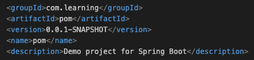
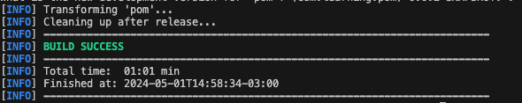
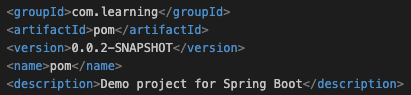
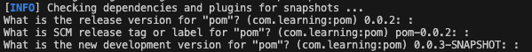
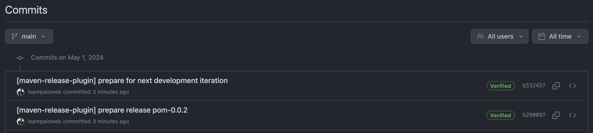
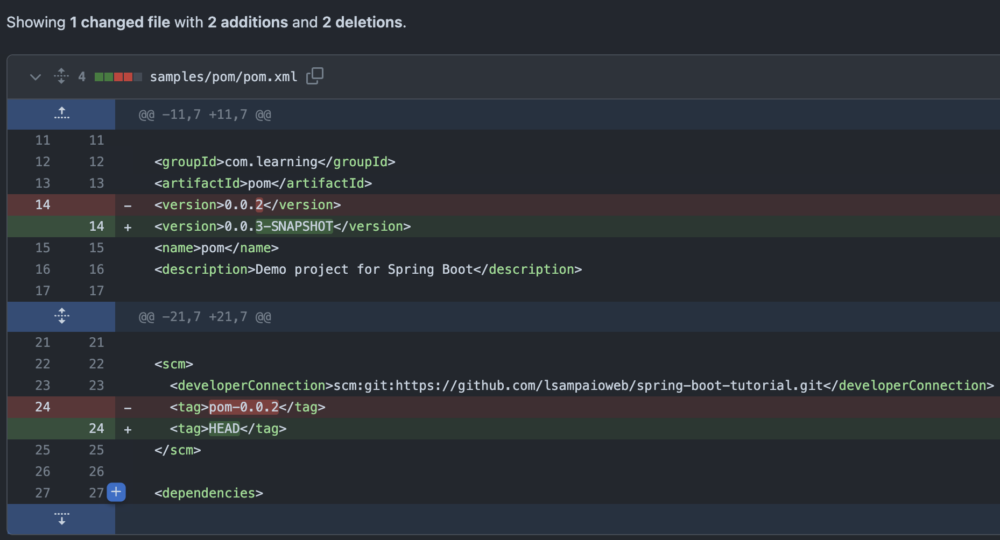
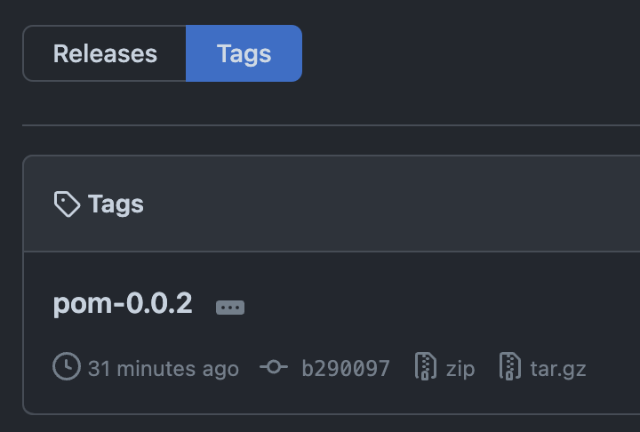

Maven commands.

1. Compile the application to make sure everything is working.

    ```bash
    mvn compile
    ```

1. Update the version of the library/application in the pom after each new feature.

    ```bash
    mvn release:update-versions
    ```

    Before:

    

    Enter the new version:

    

    Maven build success message:

    

    After:

    

1. Prepare the next release.

    Add the `scm` tag with the repository url in the pom.xml.
    ```xml
    <project>
      ...
      <scm>
        <developerConnection>scm:git:https://github.com/lsampaioweb/spring-boot-tutorial.git</developerConnection>
        <tag>HEAD</tag>
      </scm>
      ...
    </project>
    ```

    Add the `maven-surefire-plugin` plugin.
    ```xml
    <build>
      <plugins>
        ...
        <plugin>
          <artifactId>maven-surefire-plugin</artifactId>
          <version>3.2.5</version>
        </plugin>
              ...
      </plugins>
    </build>
    ```

    Create and publish a new version:

    ```bash
    mvn release:prepare
    ```

    Maven will remove the `SNAPSHOT` from the version.

    


    Maven will commit and push the new release to the repository.

    

    Maven will increase the version in the pom.xml.

    

    Maven will create a tag in the repository.

    


1. Install the package in the local maven repository, so other applications can use it.

    The path where the application will be installed is: `~/.m2/repository/`
    ```bash
    mvn install
    ```


#
### Created by:

1. Luciano Sampaio.
