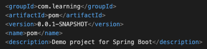
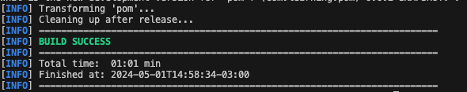
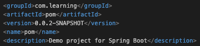
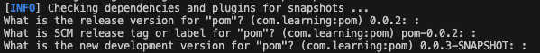
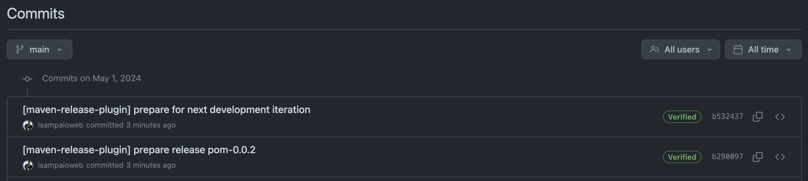
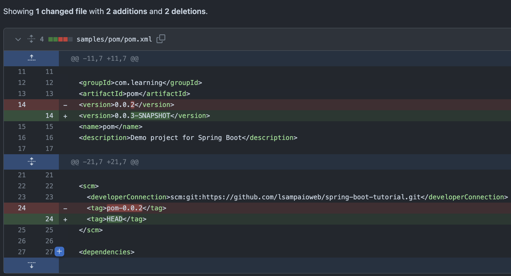
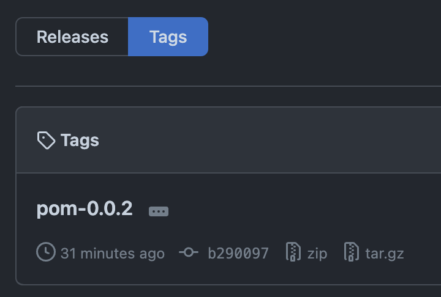

# Maven commands for this tutorial

Working sample: `samples/01-pom`

## Before you start

- Java 25 and Maven 3.9+ ([install Java](../java/install.md), [install Maven](install.md))
- Clone this repository

## Gate

```bash
mvn --version
```

The output must show Maven **3.9** or newer.

## Run the first sample

```bash
cd samples/01-pom
mvn compile
mvn test
mvn spring-boot:run
```

Expected: the application starts and exits cleanly when you press `Ctrl+C`
(this sample has no web server). Tests pass with `BUILD SUCCESS`.

## Everyday commands

| Command | Purpose |
| --- | --- |
| `mvn compile` | Compile main sources |
| `mvn test` | Run unit/integration tests |
| `mvn package` | Build the jar under `target/` |
| `mvn spring-boot:run` | Run the Spring Boot app |
| `mvn spring-boot:run -Dspring-boot.run.profiles=development` | Run with the development profile |
| `mvn clean` | Delete `target/` |

## pom.xml conventions (this repository)

1. `groupId` is `br.com.lsampaioweb` in sample POMs. Application packages often use
   `com.learning.*` — that is intentional and fine.
1. `version` keeps the `-SNAPSHOT` suffix during development.
1. Add the `<scm>` block in every module:
    ```xml
    <scm>
      <developerConnection>scm:git:https://github.com/lsampaioweb/spring-boot-tutorial.git</developerConnection>
      <tag>HEAD</tag>
    </scm>
    ```
1. Every dependency has a one-line `<!-- purpose -->` comment above the tag.
1. Dependency order: Spring Boot / Cloud / Security starters (devtools last among
   them) → third-party (alphabetical by artifactId) → internal → test-scoped last.
1. Do not leave empty `<url />` / `<licenses>` stubs; omit them if unused.
1. Later samples add dependencies only when that sample's code needs them.

## Install into the local repository (optional)

```bash
mvn install
```

Artifacts land under `~/.m2/repository/`.

## Next

[DevTools](../spring/basic/devtools.md) — `samples/02-devtools`.

## Maintainer appendix: version bumps and releases

Learners do **not** need this section. It mutates git history and can push tags.

### Update the SNAPSHOT version

```bash
mvn release:update-versions
```

Before:



Enter the new version:


Maven build success message:



After:



### Prepare a release (commits and pushes)

Ensure `maven-surefire-plugin` is present, then:

```bash
mvn release:prepare
```

Maven removes `SNAPSHOT`, commits, pushes, bumps the next SNAPSHOT, and creates a tag:









To keep all sample POMs on the same Boot train, see [Upgrade Process](upgrade.md).

[Go Back](../../README.md)

#
### Created by:

1. Luciano Sampaio.
