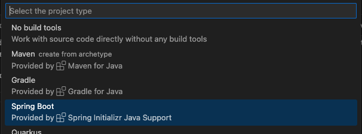
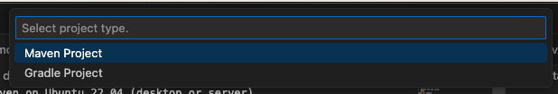
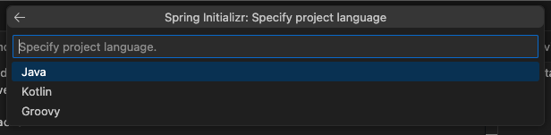
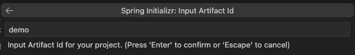
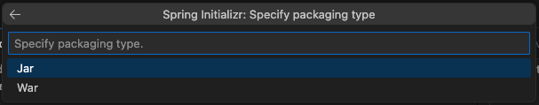
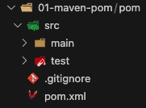

# Create a Spring Boot Project with Maven

This guide explains how to create a Spring Boot project using `VS Code` or CLI on `Ubuntu`, targeted at non-beginner Java developers.


### Using VS Code
1. Create a new Java project in `VS Code`.

    

1. Select Spring Boot project type.

    

1. Select Maven as the dependency manager.

    

1. Select the Spring Boot version.
    

1. Select Java as the project language.

    

1. Set the Group ID to `com.learning` to uniquely identify the project.

    

1. Set the Artifact ID to `pom` as the project identifier.

    

1. Select JAR as the packaging type.

    

1. Select Java version (e.g., 21, check latest with `apt search openjdk`).

    

1. Select dependencies (e.g., `spring-boot-starter-web`).

    

1. Choose the project save path.

    

1. Clean up unnecessary files after creation, assuming Maven is installed.

    
    

### Using CLI
1. Generate the project using Spring Initializr CLI.
    ```bash
    curl https://start.spring.io/starter.zip -d dependencies=web -d type=maven-project -d javaVersion=21 -d groupId=com.learning -d artifactId=pom -o pom.zip
    ```

1. Extract and navigate to the project directory.
    ```bash
    unzip pom.zip -d 01-pom
    cd 01-pom
    ```

1. Run the Spring Boot application.
    ```bash
    mvn spring-boot:run
    ```

1. Troubleshoot common issues.
    ```bash
    echo $JAVA_HOME
    mvn clean install
    apt-cache search openjdk
    ```

[Go Back](../../README.md)

#
### Created by:
1. Luciano Sampaio.
