Create a Spring Boot project using VSCode.

1. Create a new Java project.

    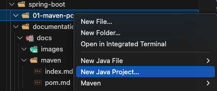

1. Select Spring Boot.

    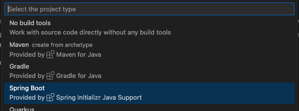

1. Select the dependency manager. We will use `Maven`.

    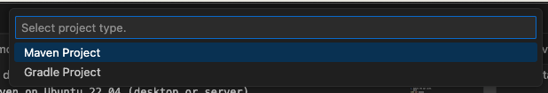

1. Select the Spring Boot version. **I recommend using the latest**.

    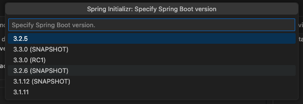

1. Select the project language. We will use `Java`.

    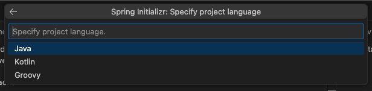

1. Select the Group ID of the project.

    The `groupId` identifies your project uniquely across all projects.

    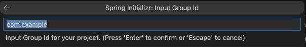

1. Select the Artifact ID of the project.

    The `artifactId` is the name of the project or module. It's a simple identifier for your project within the `groupId`.

    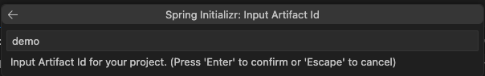

1. Select the packaging type. We will use `Jar`.

    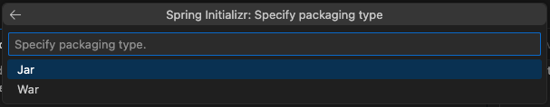

1. Select the Java version. **I recommend using the latest**.

    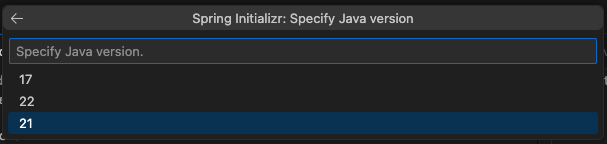

1. Select the dependencies that the project will use.

    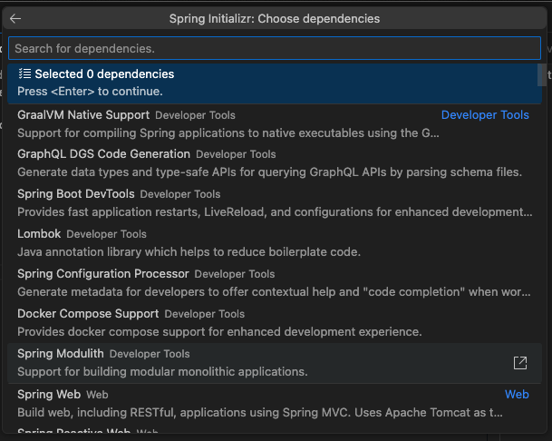

1. Select where the project will be saved.

    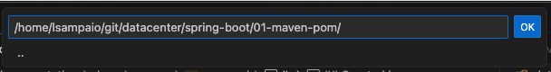

1. These are the files that will be created.

    We have already installed `Maven`, so we do not need the extra files and they can deleted:
    - .mvn
    - mvnw
    - mvnw.cmd

    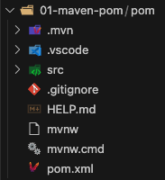

    After deleting the extra files, the folder will look like this:

    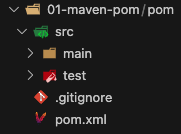

#
### Created by:

1. Luciano Sampaio.
